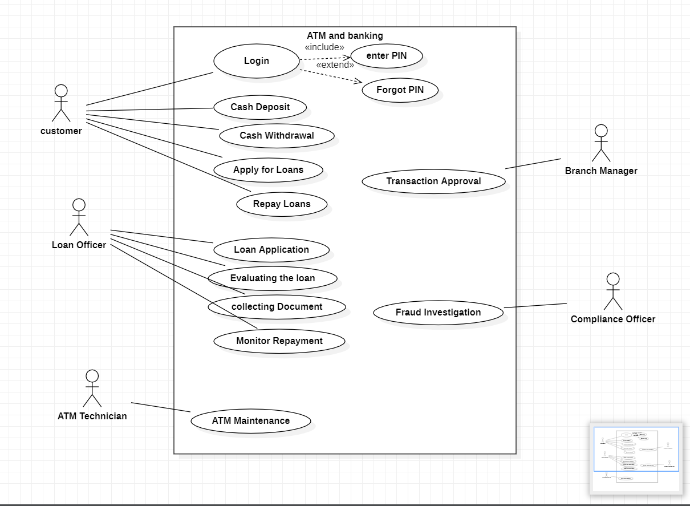
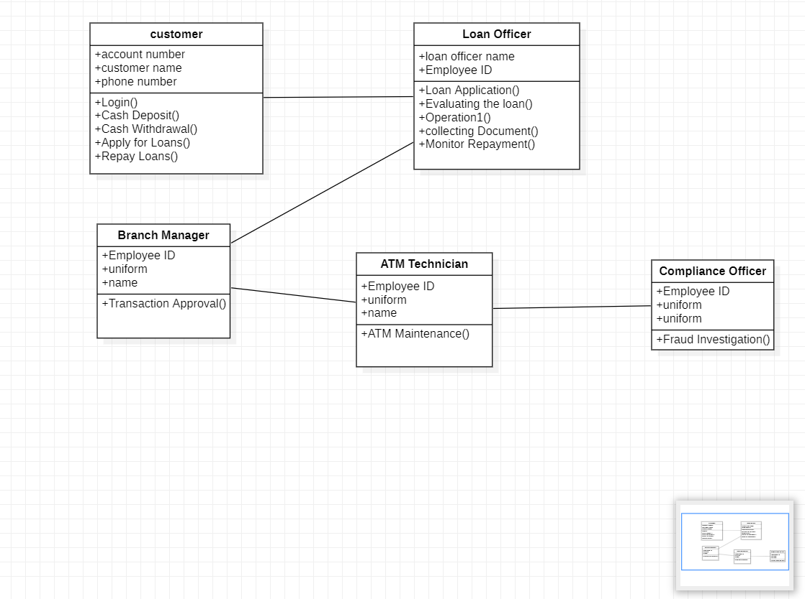
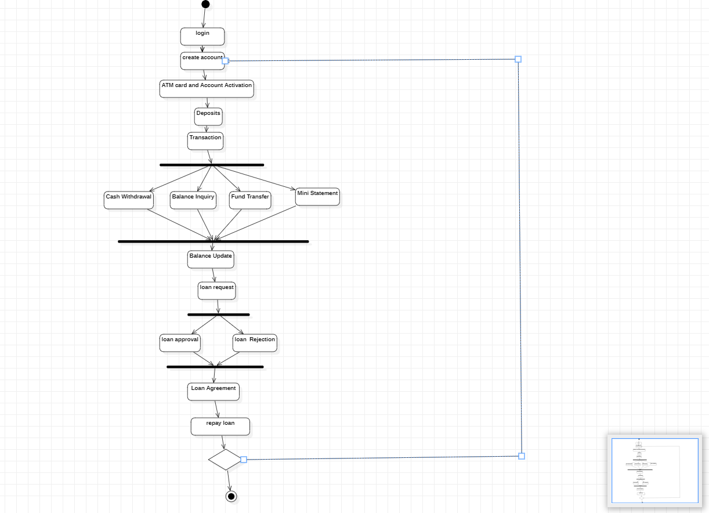
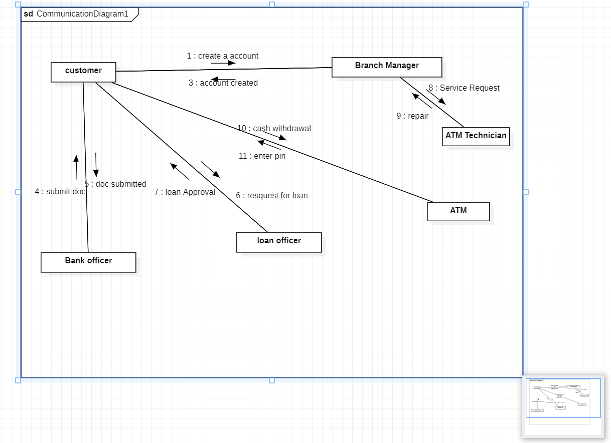
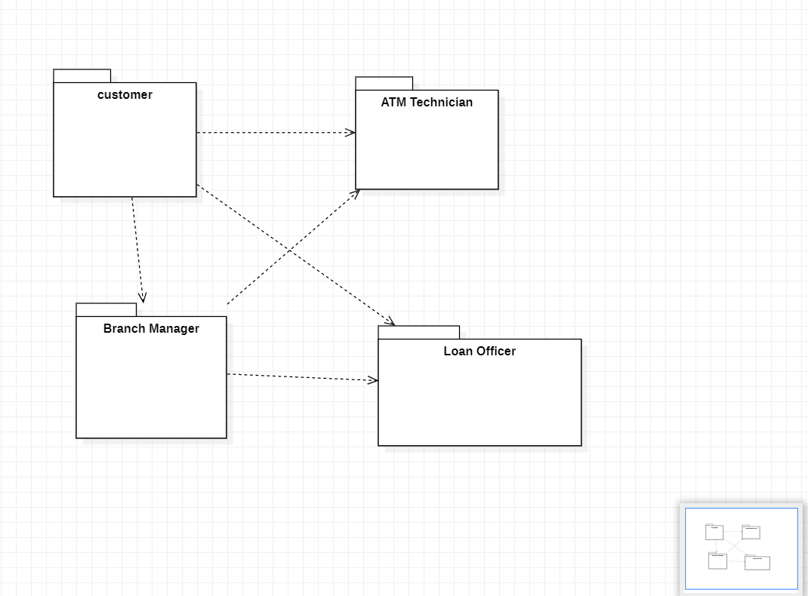
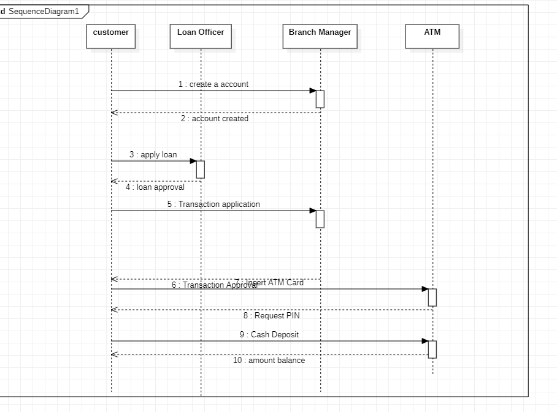

# Exp-1 ATM & BANKING SYSTEM

# AIM:
To study the problem statement and SRS of an ATM System and represent its architecture using UML diagrams.

# SRS (Procedure):
Analyze the ATM System and identify its key actors (e.g., Customer, Bank Server) and system functionalities (e.g., Withdraw Cash, Check Balance).

1.Create the Use Case Diagram to show actors and their interactions with the system. 2.Develop the Class Diagram representing classes, attributes, operations, and relationships. 3.Design the Activity Diagram describing workflows such as cash withdrawal. 4.Construct the Sequence Diagram illustrating interactions between objects during processes like PIN verification. 5.Prepare the Communication Diagram showing collaboration among objects. 6.Organize components into packages using a Package Diagram for modularity.

# DIAGRAMS:
(upload all 6 diagrams)
## USE CASE DIAGRAM:

## CLASS DIAGRAM:

## ACTIVITY DIAGRAM:

## COMMUNICATION DIAGRAM:

## PACKAGE DIAGRAM:

## SEQUENCE DIAGRAM:

# RESULT:
The ATM System is successfully analyzed, and its architecture is effectively represented using UML diagrams, providing a clear understanding of system structure and behavior.
